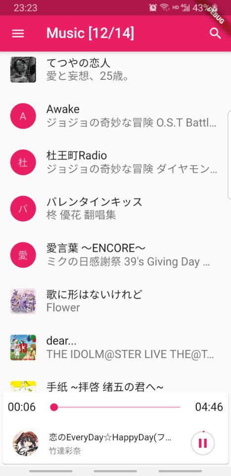

这是一个显示，播放(列表循环)本地音乐的flutter项目。[查看教程](https://www.youtube.com/watch?v=eWicXD5vkyg)

> 注：需要配置"AndroidManifest.xml"向用户获取权限。

- [flute_music_player插件](https://pub.flutter-io.cn/packages/flute_music_player)
- [更多的参考代码](https://github.com/iampawan/Flutter-Music-Player)

```
flutter packages pub run build_runner build   // 执行一次build命令
flutter packages pub run build_runner watch  // 文件更改自动打包
flutter packages pub run build_runner watch --delete-conflicting-outputs  // 删除旧文件在打包
```

